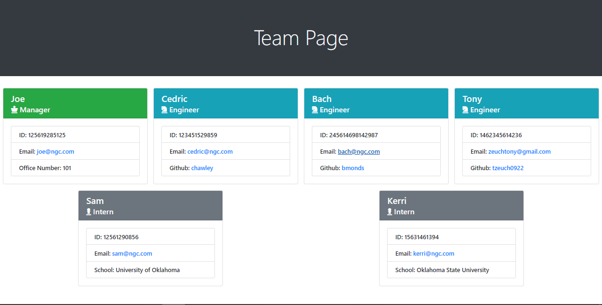

# Team Profile Generator
Generates a webpage that maps out a team based on input given by the user.

## Features
* Produces the page based on input from the user in an html format.
* Has the ability to map out a single team manager, as well as an unrestricted amount of engineers and interns.
* Used bootstrap to add resizing for different screen sizes.
* Has an icon and coloring to show the different employees.

## Potential Future Upgrades
* Better error handling, currently only acknowledges blank input and informs user to correct it.
* Allow user to add their own fields to be displayed.
* Allow user to remove fields they consider unnecessary, for example, employee number may not be necessary but it was in the original specifications.
* Add new employee types and icons, such as testers, QA, product owner, scrum master, tech lead, etc.
* Maybe add engineer levels.

## Example Screenshot

## Demonstration Video
https://drive.google.com/file/d/1abas-St9k_P1aFQGSDi4Oa8bZw8-E7v_/view